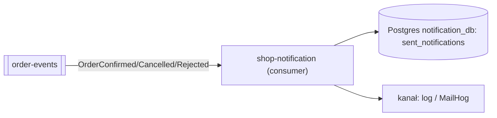
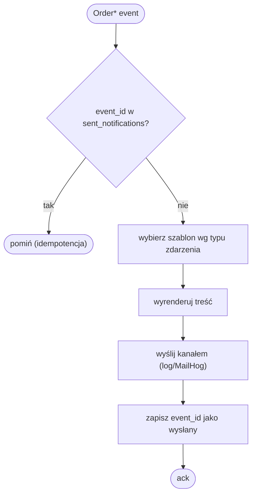

# shop-notification

Wysyła powiadomienia do klientów (e-mail, SMS, push). Wyłącznie sterowany
zdarzeniami — shop-gateway nigdy go nie woła bezpośrednio. Standalone repo z
własnym `Dockerfile` i kodem. Stack: Spring Boot + Spring Kafka + JPA (Postgres).

## Zdarzenia Kafki

Konsumuje terminalne zdarzenia zamówienia wprost z tematu **`order-events`**
(grupa `shop-notification`) — bez osobnego tematu powiadomień:
- `OrderConfirmed` → „zakup udany".
- `OrderCancelled` → „płatność/zakup nieudany".
- `OrderRejected` → „brak towaru".

To zwykła subskrypcja zdarzeń domenowych: `shop-order` publikuje je do
`order-events` na potrzeby sagi, a `shop-notification` po prostu je odsłuchuje
własną grupą konsumenta (nie publikuje żadnych zdarzeń — to liść grafu).

## Logika (do zaimplementowania)

1. Odbierz zdarzenie, sprawdź `sent_notifications(event_id PK)` — jeśli już
   wysłane, zignoruj (idempotencja; Kafka dostarcza at-least-once).
2. Wybierz szablon wg typu zdarzenia, wyrenderuj treść.
3. Wyślij kanałem (w demie: log albo MailHog), zapisz `event_id` jako wysłany.

## Wysyłka w demie
Dla namacalnego efektu można dołożyć **MailHog** (lekki fałszywy SMTP z webowym
podglądem) jako dodatkowy serwis w docker-compose i ustawić `spring.mail.*` na
niego. Bez tego wystarczy logować „wysłano".

## Idempotencja
`sent_notifications(event_id PK, channel, sent_at)` — klient nie dostanie tego
samego maila dwa razy.

## Skalowanie
Bezstanowy konsument → wiele instancji w grupie (≤ liczba partycji `order-events`,
tj. 6). Ruch powiadomień jest mniej krytyczny niż rezerwacja, więc zwykle
wystarczy mniej instancji niż partycji — to normalne.

## Konfiguracja (env)
`SPRING_DATASOURCE_URL=.../notification_db`,
`SPRING_KAFKA_BOOTSTRAP_SERVERS=shop-kafka:9092`,
`SPRING_KAFKA_CONSUMER_GROUP_ID=shop-notification`.

## High Level Design (ogólny workflow)

Liść grafu: konsumuje terminalne zdarzenia zamówienia z `order-events`,
idempotentnie wysyła powiadomienie (log/MailHog), nic nie publikuje.

## Low Level Design (diagram aktywności)

