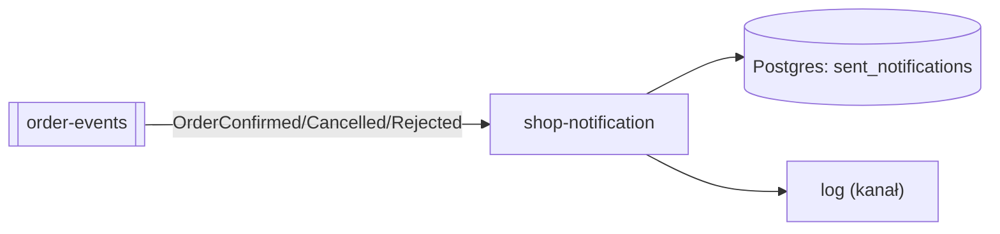
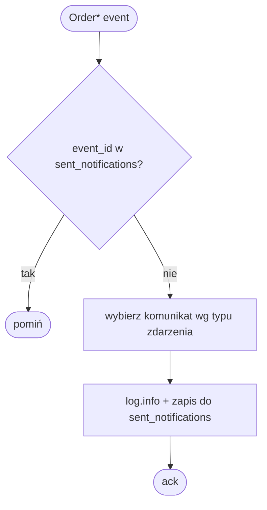

# shop-notification

Liść grafu mikroserwisów: konsumuje terminalne zdarzenia zamówienia z Kafki i idempotentnie loguje powiadomienie do klienta. Nie publikuje żadnych zdarzeń. Sterowany wyłącznie zdarzeniami — żaden inny serwis nie woła go bezpośrednio.

**Stack:** Spring Boot 4.0.7 · Java 25 · Spring Kafka · Spring Data JPA · PostgreSQL · Flyway

## Zdarzenia Kafki

Konsumuje temat **`order-events`** (grupa `shop-notification`):

| Typ zdarzenia      | Powiadomienie          |
|--------------------|------------------------|
| `OrderConfirmed`   | „purchase success"     |
| `OrderCancelled`   | „payment failed"       |
| `OrderRejected`    | „out of stock"         |

Inne typy zdarzeń są ignorowane.

## Idempotencja

Tabela `sent_notifications` (Flyway `V1__init.sql`) deduplikuje zdarzenia przez `event_id PK`:

```sql
sent_notifications(event_id PK, channel, event_type, order_id, message, sent_at)
```

Kafka dostarcza at-least-once — zdarzenie już przetworzone jest pomijane bez wysyłki.

## Konfiguracja (env)

| Zmienna                              | Domyślnie              |
|--------------------------------------|------------------------|
| `SPRING_DATASOURCE_URL`              | —                      |
| `SPRING_DATASOURCE_USERNAME`         | —                      |
| `SPRING_DATASOURCE_PASSWORD`         | —                      |
| `SPRING_KAFKA_BOOTSTRAP_SERVERS`     | —                      |
| `SPRING_KAFKA_CONSUMER_GROUP_ID`     | `shop-notification`    |

Actuator: `GET /actuator/health`, `GET /actuator/info`.

## Uruchomienie

```bash
./gradlew build
docker build -t shop-notification .
```

Testy integracyjne (Cucumber + Testcontainers — PostgreSQL 17 w kontenerze):

```bash
./gradlew test
```

## CI

Każdy PR uruchamia preprod gate (`pr-to-main.yml`): buduje obraz, deployuje na klaster `kind-preprod` i odpala cross-service acceptance suite (`shop-acceptance-tests`).

## Diagramy




